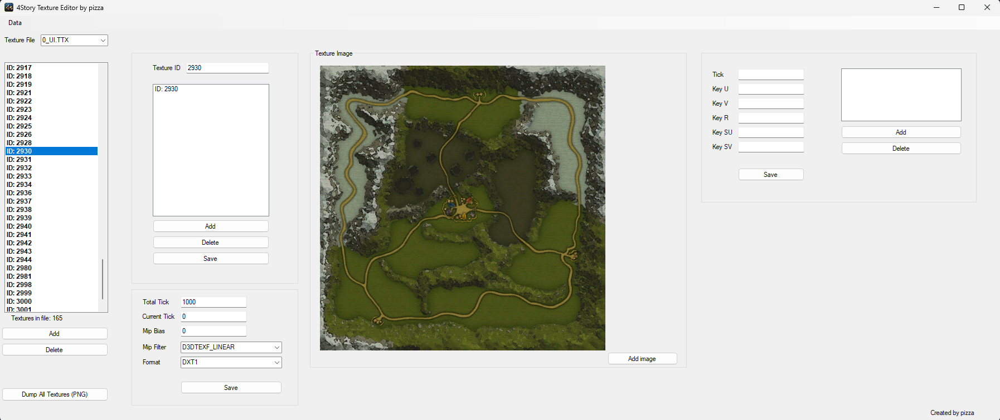
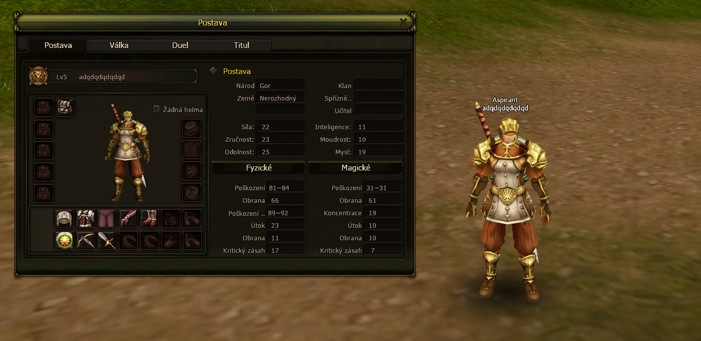

# 4Story-Texture-Editor

An editor that loads 4Story texture files (.TTX) any texture can be changed and it's info can be modified also a new texture can be added or an existing one can be deleted. All changes can be saved and (.TTX) files are generated aswell (.IDX) index file containing info about Texture ID, File ID and Position in the file of the texture.

### Steps to run the program
1. Clone the repository:
   ```bash
   git clone https://github.com/JakubJosefKrasa/4StoryTextureEditor.git

2. Build on Release or Debug x86

3. Run the generated TextureEditor.EXE file located in <strong>.\bin\Debug</strong> or <strong>.\bin\Release</strong>



